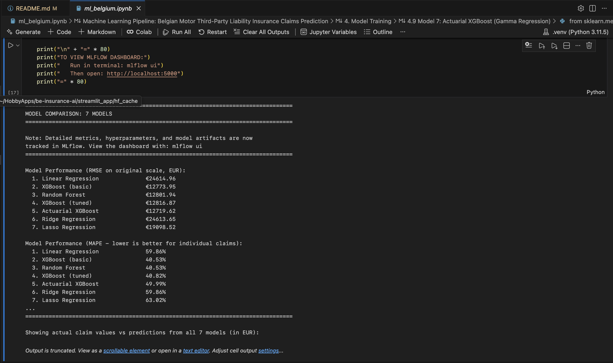
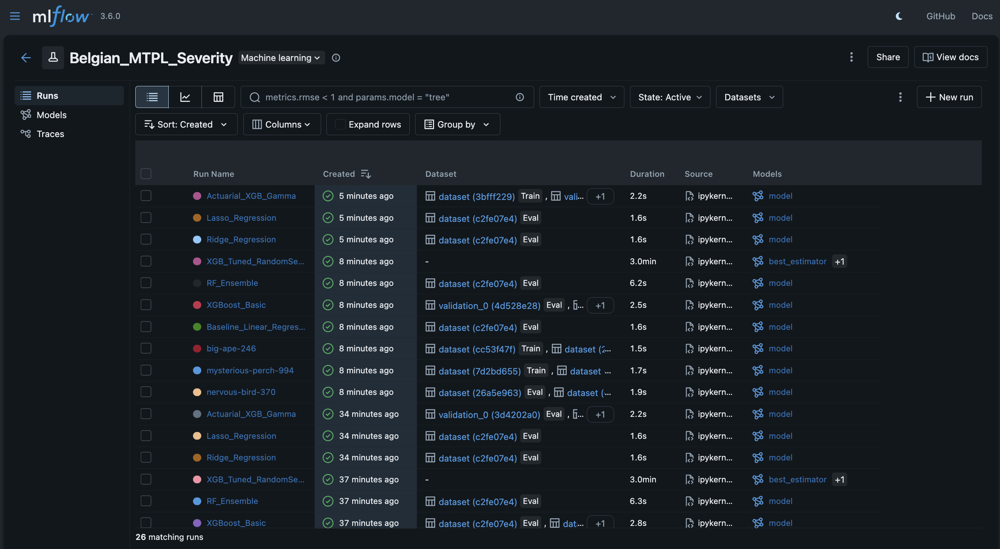
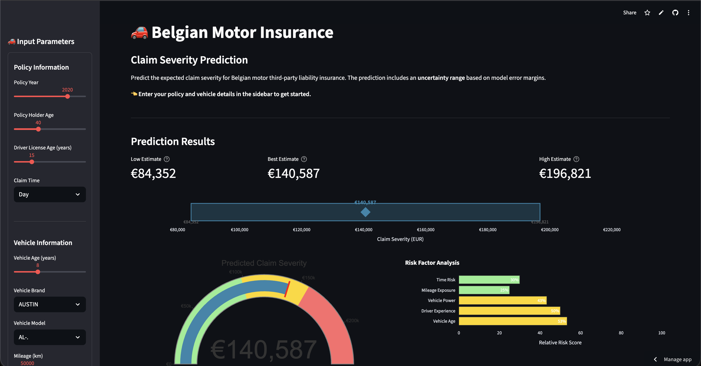
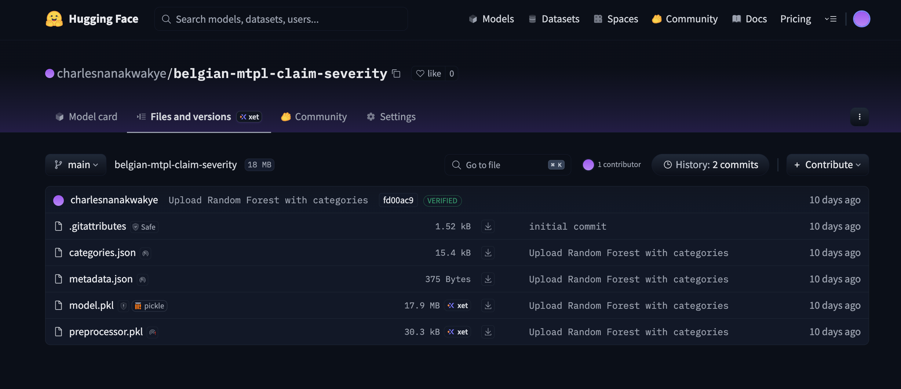

# Belgian Motor Insurance Claim Severity Prediction

[](https://python.org)
[](https://belgian-mtpl-claim-severity.streamlit.app/)
[](https://huggingface.co/charlesnanakwakye/belgian-mtpl-claim-severity)
[](https://mlflow.org)
[](https://scikit-learn.org)

> **End-to-end Machine Learning pipeline** for predicting individual insurance claim severity with best-in-class accuracy, featuring automated model versioning and a production-ready web application.
>
> **Current Best Model**: Random Forest (selected for lowest MAPE on individual claims)

---

## Table of Contents

- [Project Overview](#project-overview)
- [Architecture](#architecture)
- [Key Features](#key-features)
- [Tech Stack](#tech-stack)
- [Project Structure](#project-structure)
- [Dataset](#dataset)
- [ML Pipeline](#ml-pipeline)
- [Model Performance](#model-performance)
- [Deployment](#deployment)
- [Getting Started](#getting-started)
- [Screenshots](#screenshots)
- [What I Learned](#what-i-learned)
- [Future Improvements](#future-improvements)

---

## Project Overview

This project demonstrates a **complete ML workflow** from raw data to production deployment:

1. **Data Engineering**: Load and preprocess Belgian MTPL insurance data
2. **Feature Engineering**: Transform raw features including time-based categorical encoding
3. **Model Development**: Train and compare 7 different regression models
4. **Experiment Tracking**: Log all experiments with MLflow for reproducibility
5. **Model Registry**: Version and store artifacts on Hugging Face Hub
6. **Production App**: Serve predictions via an interactive Streamlit web application

### The Problem

Insurance companies need to **predict claim severity** (the expected cost of a claim) to:
- Set appropriate premium prices
- Allocate reserves for future claims
- Identify high-risk policies

### The Solution

A **Random Forest model** trained on 70,000+ Belgian motor insurance claims, optimized for individual claim accuracy (lowest MAPE) while maintaining strong overall performance.

---

## Architecture

```
┌─────────────────────────────────────────────────────────────────────────────┐
│                          DATA & TRAINING PIPELINE                           │
├─────────────────────────────────────────────────────────────────────────────┤
│                                                                             │
│   ┌──────────────┐    ┌──────────────┐    ┌──────────────────────────────┐ │
│   │   beMTPL16   │───▶│   Jupyter    │───▶│        MLflow Server         │ │
│   │   Dataset    │    │   Notebook   │    │   (Experiment Tracking)      │ │
│   │   (R data)   │    │              │    │   - 7 Model Comparisons      │ │
│   └──────────────┘    │  • Clean     │    │   - Hyperparameters          │ │
│                       │  • Engineer  │    │   - Metrics (RMSE, MAPE)     │ │
│                       │  • Train     │    └──────────────────────────────┘ │
│                       │  • Evaluate  │                                     │
│                       └──────┬───────┘                                     │
│                              │                                             │
│                              ▼                                             │
│                    ┌──────────────────┐                                    │
│                    │   Hugging Face   │                                    │
│                    │      Hub         │                                    │
│                    │  • model.pkl     │                                    │
│                    │  • preprocessor  │                                    │
│                    │  • categories    │                                    │
│                    └────────┬─────────┘                                    │
│                             │                                              │
└─────────────────────────────┼──────────────────────────────────────────────┘
                              │
                              │  Download on startup
                              ▼
┌─────────────────────────────────────────────────────────────────────────────┐
│                         PRODUCTION DEPLOYMENT                               │
├─────────────────────────────────────────────────────────────────────────────┤
│                                                                             │
│   ┌──────────────────────────────────────────────────────────────────────┐ │
│   │                        Streamlit Cloud                               │ │
│   │   ┌────────────────┐    ┌─────────────────┐    ┌─────────────────┐  │ │
│   │   │   User Input   │───▶│  Preprocessing  │───▶│   Prediction    │  │ │
│   │   │   (Web Form)   │    │   Pipeline      │    │ (Random Forest) │  │ │
│   │   └────────────────┘    └─────────────────┘    └────────┬────────┘  │ │
│   │                                                         │           │ │
│   │                                                         ▼           │ │
│   │                                              ┌─────────────────┐    │ │
│   │                                              │  Claim Severity │    │ │
│   │                                              │    €X,XXX.XX    │    │ │
│   │                                              └─────────────────┘    │ │
│   └──────────────────────────────────────────────────────────────────────┘ │
│                                                                             │
└─────────────────────────────────────────────────────────────────────────────┘
```

### Data Flow

1. **Source**: Belgian MTPL (Motor Third-Party Liability) insurance dataset (`beMTPL16.rda`)
2. **Training**: Jupyter notebook processes data, trains models, tracks experiments with MLflow
3. **Storage**: Best model + preprocessor + metadata uploaded to Hugging Face Hub
4. **Serving**: Streamlit app pulls artifacts from HF Hub and serves predictions

---

## Key Features

| Feature | Description |
|---------|-------------|
| **Multi-Model Comparison** | Train and evaluate 7 different models in one pipeline |
| **Individual Claim Focus** | Optimized for lowest MAPE (best individual claim accuracy) |
| **Feature Engineering** | Time-to-period conversion, age calculations, categorical encoding |
| **Experiment Tracking** | Full MLflow integration for reproducibility |
| **Model Versioning** | Hugging Face Hub for artifact storage and versioning |
| **Production Ready** | Deployable Streamlit app with error handling |
| **Target Encoding** | Handle high-cardinality categoricals (1000+ vehicle models) |

---

## Tech Stack

### Data & ML
| Tool | Purpose |
|------|---------|
| **pandas** | Data manipulation and analysis |
| **NumPy** | Numerical computing |
| **scikit-learn** | ML algorithms, preprocessing, pipelines |
| **XGBoost** | Gradient boosting |
| **category_encoders** | Target encoding for high-cardinality features |
| **pyreadr** | Read R data files (.rda) |

### MLOps
| Tool | Purpose |
|------|---------|
| **MLflow** | Experiment tracking, metric logging |
| **Hugging Face Hub** | Model registry and artifact storage |
| **joblib** | Model serialization |

### Deployment
| Tool | Purpose |
|------|---------|
| **Streamlit** | Interactive web application |
| **Streamlit Cloud** | Free hosting platform |

---

## Project Structure

```
be-insurance-ai/
├── ml_belgium.ipynb         # Main ML pipeline notebook
├── data/
│   └── beMTPL16.rda         # Belgian MTPL insurance dataset
├── mlruns/                  # MLflow experiment tracking
│   └── 653770752589350789/  # Experiment runs, metrics, artifacts
├── streamlit_app/           # Production web application
│   ├── app.py               # Streamlit application
│   ├── requirements.txt     # App dependencies
│   └── README.md            # App documentation
├── requirements.txt         # Training dependencies
├── .env.example             # Environment variables template
├── .gitignore
└── README.md                # This file
```

---

## Dataset

### Belgian MTPL Insurance Data (beMTPL16)

| Attribute | Details |
|-----------|---------|
| **Records** | 70,791 insurance claims |
| **Source** | Belgian Motor Third-Party Liability Insurance |
| **Period** | 2004-2016 |
| **Target** | Claim severity (amount in EUR) |

### Features Used

| Feature | Type | Description |
|---------|------|-------------|
| `policy_year` | Numeric | Year the policy was issued |
| `vehicle_age` | Numeric | Age of the vehicle in years |
| `policy_holder_age` | Numeric | Age of the policy holder |
| `driver_license_age` | Numeric | Years since license obtained |
| `vehicle_brand` | Categorical | Vehicle manufacturer (100+ unique) |
| `vehicle_model` | Categorical | Vehicle model (1000+ unique) |
| `mileage` | Numeric | Vehicle mileage in km |
| `vehicle_power` | Numeric | Engine power in HP |
| `catalog_value` | Numeric | Vehicle catalog price in EUR |
| `claim_time` | Categorical | Day/Night (engineered from timestamp) |

### Feature Engineering

```python
# Convert raw claim time to Day/Night categories
def time_to_day_night(time_str):
    """
    Night: 20:00 - 06:00
    Day: 06:00 - 20:00
    """
    hour = int(time_str.split(':')[0])
    return 'Night' if hour >= 20 or hour < 6 else 'Day'
```

---

## ML Pipeline

### Models Trained

| # | Model | Approach | Purpose |
|---|-------|----------|---------|
| 1 | Linear Regression | Baseline | Simple benchmark |
| 2 | Ridge Regression | L2 Regularization | Prevent overfitting |
| 3 | Lasso Regression | L1 Regularization | Feature selection |
| 4 | **Random Forest** | Ensemble (Bagging) | **Best - Individual Claims** |
| 5 | XGBoost (Basic) | Gradient Boosting | Non-linear patterns |
| 6 | XGBoost (Tuned) | Hyperparameter Search | Optimized performance |
| 7 | Actuarial XGBoost | Gamma Loss | Best for portfolio risk |

### Preprocessing Pipeline

```python
# Numeric features: StandardScaler
numeric_pipeline = Pipeline([
    ('scaler', StandardScaler())
])

# Low-cardinality categoricals: OneHotEncoder
low_card_pipeline = Pipeline([
    ('onehot', OneHotEncoder(handle_unknown='ignore'))
])

# High-cardinality categoricals: TargetEncoder
high_card_pipeline = Pipeline([
    ('target', TargetEncoder())
])
```

### Why Random Forest?

For **individual claim predictions**, Random Forest achieves the lowest MAPE (Mean Absolute Percentage Error):

- Best accuracy on individual claim amounts
- Ensemble of decision trees reduces overfitting
- Handles mixed feature types well
- Robust to outliers via log-transformation

> **Note**: For portfolio-level reserve calculations where large claims matter more, the Actuarial XGBoost (Gamma loss) model achieves lower RMSE.

---

## Model Performance

### Comparison Results

| Model | RMSE (EUR) | MAPE (%) |
|-------|------------|----------|
| Linear Regression | €24,615 | 59.86% |
| Ridge Regression | €24,614 | 59.86% |
| Lasso Regression | €19,099 | 63.02% |
| **Random Forest** | **€12,802** | **40.53%** |
| XGBoost (Basic) | €12,774 | 40.53% |
| XGBoost (Tuned) | €12,817 | 40.82% |
| Actuarial XGBoost | €12,720 | 49.99% |

> *Best model selected by lowest MAPE for individual claim accuracy. View detailed metrics in MLflow dashboard.*

---

## Deployment

### Hugging Face Hub

The trained model and artifacts are stored on Hugging Face Hub for:
- **Version Control**: Track model iterations
- **Easy Access**: Download artifacts with one line of code
- **Collaboration**: Share models publicly

```python
# Download model in Streamlit app
from huggingface_hub import hf_hub_download

model_path = hf_hub_download(
    repo_id="charlesnanakwakye/belgian-mtpl-claim-severity",
    filename="model.pkl"
)
```

### Streamlit Cloud

The web app is deployable to Streamlit Cloud with:
- **Zero infrastructure**: No servers to manage
- **Auto-scaling**: Handles traffic automatically
- **Free tier**: Perfect for portfolio projects

---

## Getting Started

### Prerequisites

- Python 3.10+
- pip or conda

### Installation

```bash
# Clone the repository
git clone https://github.com/charleskwakye/be-insurance-ai.git
cd be-insurance-ai

# Create virtual environment
python -m venv venv
source venv/bin/activate  # On Windows: venv\Scripts\activate

# Install dependencies
pip install -r requirements.txt
```

### Train the Model

1. Open `ml_belgium.ipynb` in Jupyter or VS Code
2. Run all cells sequentially
3. View experiments in MLflow UI:
   ```bash
   mlflow ui
   ```
4. The best model will be uploaded to Hugging Face Hub

### Run the Web App

```bash
cd streamlit_app
pip install -r requirements.txt
streamlit run app.py
```

### Environment Variables

Create a `.env` file for Hugging Face authentication:

```bash
cp .env.example .env
# Edit .env and add your HF_TOKEN
```

---

## Screenshots

### ML Notebook - Model Training



*Training 7 different models with MLflow tracking*

### MLflow - Experiment Tracking



*Compare model performance across experiments*

### Streamlit App - Prediction Interface

<!-- Add screenshot here -->


*User-friendly interface for claim severity predictions*

### Hugging Face - Model Registry



*Versioned model storage with artifact browser*

---

## What I Learned

### Technical Skills
- **ML Pipeline Design**: Building end-to-end pipelines from data to deployment
- **Feature Engineering**: Creating meaningful features from raw data
- **Model Selection**: Comparing models systematically with proper validation (MAPE vs RMSE tradeoffs)
- **MLOps**: Experiment tracking, model versioning, and deployment automation
- **Insurance ML**: Understanding the difference between individual claim and portfolio-level predictions

### Tools & Frameworks
- **scikit-learn Pipelines**: Composing preprocessing and modeling steps
- **XGBoost**: Advanced gradient boosting with custom objectives
- **MLflow**: Industry-standard experiment tracking
- **Hugging Face Hub**: Modern model registry
- **Streamlit**: Rapid prototyping of ML applications

### Best Practices
- **Reproducibility**: All experiments are tracked and reproducible
- **Code Organization**: Modular, well-documented code
- **Error Handling**: Robust application with graceful error handling
- **Version Control**: Git for code, HF Hub for models


